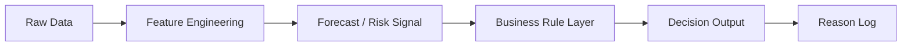

# Food Procurement & SCM AI Portfolio

식품·제조 구매/SCM 현장에서 반복되는  
가격·수요·재고·수급 리스크 판단을  
AI/ML 기반 의사결정 모델로 구조화하는 포트폴리오입니다.

---

## Core Direction

| Area | Decision Problem | Output |
|---|---|---|
| Raw Material Procurement | 원자재 가격 상승 리스크 | BUY / WAIT |
| Procurement Decision | 가격·환율·운임·재고 기반 구매 후보 비교 | 구매 우선순위 |
| S&OP / Demand Planning | 브랜드×SKU×채널 수요예측 | 발주 / 배분 / 리뷰 |
| Replenishment | 식품·소비재 보충 발주 판단 | 발주 / 보류 / 검토 |
| Healthcare GPO | 병원 구매 후보 비교 | 구매의사결정 추천 |

---

## Portfolio Model Line-up

| No | Model | Business Problem | Repository |
|---|---|---|---|
| 1 | Raw Material Forecast | 원자재 가격 흐름을 BUY/WAIT 구매 검토 신호로 전환 | [Repo](https://github.com/gibsifnger/model1_raw_material_forecast) |
| 2 | Healthcare GPO Procurement MVP | 헬스케어 GPO 구매의사결정 모델 | [Repo](https://github.com/gibsifnger/model2_healthcare_gpo_procurement_mvp) |
| 3 | Procurement Decision Pipeline | 가격·환율·운임·재고·Open PO 기반 구매 후보 비교 | [Repo](https://github.com/gibsifnger/model2_procurement_decision_pipeline) |
| 4 | S&OP Demand Planning | 브랜드×SKU×채널 수요예측·배분·보충발주 액션 | [Repo](https://github.com/gibsifnger/model3_olive_sop_light) |
| 5 | Product Replenishment Decision | 식품/소비재 보충 발주 의사결정 패키지 | [Repo](https://github.com/gibsifnger/model3_product_replenishment_decision_pipeline) |
| 6 | Edible Oil Procurement Decision | 유지류 가격·환율·운임·재고 기반 구매 액션 판단 | [Repo](https://github.com/gibsifnger/model4_edible_oil_procurement_decision) |

---

## Decision Pipeline Structure

---

## What This Portfolio Shows

- 구매·SCM 현장의 반복 판단을 데이터 기반 기준으로 전환
- 단순 예측 모델이 아니라 실제 구매 액션으로 연결
- 가격, 환율, 운임, 재고, 수요예측, 리드타임, 제약조건을 함께 고려
- BUY / WAIT / REVIEW / ACCELERATE 같은 실행 가능한 판단 구조 설계

---

## Tech Stack

`Python` · `Pandas` · `Scikit-learn` · `FastAPI` · `Machine Learning` · `SCM` · `Procurement` · `S&OP`
